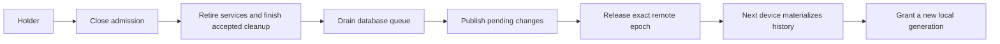

# Device Sync

Two devices, one store, one active writer. Device sync replicates every app's
shared tables. Remote ownership, local execution authority, background service
lifetime, and presentation are separate responsibilities:

| Component | Responsibility |
|---|---|
| `kernel/src/repl/` | Validate history, materialize it, and change remote ownership through CAS |
| `kernel/src/store/authority.rs` | Admit work to a generation, revoke it, and wait for its activity to finish |
| `kernel/src/app.rs` | Start and retire services when local authority changes |
| `kernel/src/effect.rs` | Fence provider operations and carry authority into native descendants |
| `kernel/src/session/` | Reject stale prepared work and expose the store's actual write permission |
| shell | Display the state and dispatch the requested operation |

Both devices must connect to the same bucket URL, including its path prefix.
Without that configuration each runs independently; signing into the same
Telegram account does not pair their notes, feeds, or write leases. Telegram's
native login session and credentials remain local to each device.

Opening a previously synced database without a bucket enables local writes and
recovers interrupted jobs before starting workers. Its saved lineage and pending
changes remain intact. Reconnecting later still validates that history; local
changes can require explicit recovery if another device has advanced it.

## The log

SQLite's session extension records each transaction over the durable tables as
a changeset in `repl_log`. The changeset and its log row are written in the
same transaction. Applying a changeset from another device records nothing, so
an applied frame never echoes back into the log it came from.

Replay validates each affected table's full positional layout before applying
anything. SQLite can otherwise skip an incompatible table without reporting
a changeset conflict. Foreign-key cascades already present in the recorded
changeset are not run a second time: replay uses
[`SQLITE_CHANGESETAPPLY_FKNOACTION`](https://www.sqlite.org/session/c_changesetapply_fknoaction.html).
Search-index triggers remain enabled. An indirect deletion already performed
by a retained trigger is accepted only after its recorded old values have been
validated against the receiver's baseline; other missing rows still fail.

A batch is a length-prefixed list of frames, one per transaction, so a failed
apply can name the transaction that failed rather than the whole batch. Every
device-sync object carries a wire-format version, and an unknown value is
refused rather than guessed at.

## The bucket

Devices exchange snapshots and batches through a small object-store interface:
read, create-only write, and compare-and-swap. A single `state` object contains
both the current lease and the log head. Updating the head therefore also
proves that the device still owns the lease.

The first device finds no lineage and **bootstraps**: it becomes the holder,
initializes the store, uploads a snapshot, and publishes. Real installs start
empty; scripted runs seed their demo fixtures. Another device
installs that snapshot and then applies later batches.
Snapshot installation preserves the receiving device's identity and restores
related rows together, including children with cascading deletes. A snapshot
with broken foreign keys rolls back without advancing the local log position.
Parents are restored before their children where possible, avoiding repeated
full-table scans on large archives; cyclic references are checked at commit.
SQLite changesets address columns by position. The lineage's schema fingerprint
therefore includes each table's ordered columns and primary keys, and a snapshot
with a different column order is refused before changing any rows. Telegram
migrates early topic databases into the same order as a fresh install.
Lineages written before this compatibility check need a new shared snapshot
under a new bucket prefix after all devices have been updated.
The initial snapshot includes the database's history and search indexes, so it
can be much larger than later batches. Uploads receive a size-based timeout
allowance, while stalled connections still time out.

The transport is chosen by the URL. `http://` is `bucketd`, a small daemon
serving a directory with the compare-and-swap semantics the lease needs, which
is what local demos use. `https://` is Cloudflare R2 through its S3 API, where
`If-None-Match: *` is the create-only put and `If-Match: <etag>` is the
compare-and-swap, each answered `412` when its precondition loses. The
canonical publication therefore rests on the object store itself. R2 documents
[strong consistency for its S3 API](https://developers.cloudflare.com/r2/reference/consistency/)
and [conditional PutObject support](https://developers.cloudflare.com/r2/api/s3/api/).
The mutable state is accessed directly through that API; caching it behind a
public custom domain would weaken the reads on which the protocol depends.

A local bucket is polled every 1.5 seconds and a real one every 5, because two
million class-B operations a month is a lot to pay for asking a question whose
answer almost never changes. A holder's write publishes at once either way: the
driver is kicked, not waited for.

## The lease

Only the lease holder may write. `Role` is where a device stands:

| Role | What it means |
|---|---|
| `Detached` | no bucket configured, or one this device has never reached: local and writable |
| `Holder` | this device holds the lease and the store is writable |
| `Free` | the last holder released it; anyone may acquire |
| `Follower` | another device holds it; read-only |
| `Waiting` | a handoff was requested; the current holder is finishing publication |
| `Stranded` | ownership moved with unpublished local changes; read-only, recovery is manual |
| `Recovering` | recovery is queued or restoring shared data; read-only, with no action button |
| `Incompatible` | the devices have different table layouts; update them before syncing |
| `Syncing` | ownership changed during a pass; checking it again with admission closed |
| `Fault` | history validation, replay, or local storage failed; read-only |
| `Offline` | communication failed after a join; read-only until ownership is established again |

A configured device starts with admission closed. Persisted ownership is
historical evidence, not permission to resume writing after a restart. A failed
network request also closes admission and retires writer services. A later
successful pass may reopen it only after confirming ownership, reconciling any
acknowledgement that was lost, and finishing retirement of the previous local
generation. Devices without a configured bucket continue to work locally, and
so does a device whose passes against its bucket fail before it has ever
joined: it has no lineage, so there is no writer to fence it from, what it
writes before the join is replaced by the install, and a pause or a reconnect
has no lease to ask it for — it may switch to another bucket freely. Locking
it would put a mistyped url behind a screen with no button and no form to
correct it on.

Transport failures and invalid history have different error types. An apply
conflict cannot produce the misleading message that the bucket is unreachable.
Ordinary ownership contention is `Syncing`, rather than a network error. The
original error remains available with the status.

The holder releases the lease on sleep and on close. **Take over** requests a
cooperative handoff: the current holder closes write admission, retires its
background services and native clients, waits for accepted work to return,
drains accepted database transactions, publishes them, and releases. The released lease is
reserved for the requesting device, which catches up before becoming writable.
Both devices must run a build with handoff support. A device that goes away
while waiting cancels its request.

Release records local intent to remain suspended before attempting network I/O.
If publication or the final release request fails, subsequent polls finish
that release; seeing the old remote ownership record cannot restart workers.

If the holder cannot answer, **force takeover** is a separate action on the
waiting screen. This fences the old holder's publications immediately. A
disconnected former holder can have work accepted before it detects the loss;
the new writer cannot remotely stop that process. Once revocation or uncertain
connectivity is observed, local admission stays closed through subsequent
failures.
**Recover** saves its database, including unpublished changes, under
`sync-recovery/` beside the store before replacing its shared tables with
canonical history. Recovery follows the current writer; it does not force
another takeover. The backup is retained for manual inspection and restoration
of any needed local work. Ordinary polling and acquisition never reset a
divergent branch automatically.

Recovery shows **recovering this device** from the moment it is requested,
including while saving the backup, downloading, and replaying shared changes.
Repeated requests share the recovery already in progress. Installing the
snapshot clears the old divergence status atomically with its pending branch.
If later replay fails, the screen reports that failure and subsequent polls
resume from the restored baseline; they do not ask for another recovery.

The lease driver keeps its own asynchronous task and command channel inside the kernel: it
needs acquire, release, override, and recovery, not only a kick, which is why it is not
an ordinary [worker](./apps.md#workers).

### Local authority and service lifetime

The responsibilities have explicit owners:

| Module | Responsibility |
|---|---|
| `repl/driver.rs` | Serialize network passes and honor the newest UI intent |
| `repl/protocol.rs` | Validate history and transfer the remote fencing token |
| `store/authority.rs` | Gate writes, identify generations, and join accepted activity |
| `app.rs` | Start and retire provider services from authority notifications |
| `session/work.rs` and `session/edits.rs` | Keep accepted UI completions and compensation inside the drain |
| `store/repl/replay.rs` | Apply captured row changes with baseline and constraint validation |

A file-backed database also has a Unix process lock acquired before migrations.
Two processes cannot share one device identity and independently run its native
sessions. The lock survives until the writer drains and closes SQLite; another
reader inside that process must use the same `Db`. Older binaries do not honor
this lock and must be closed before starting the updated app. Non-Unix file
stores require a platform lock implementation before they can open.

A bounded `repl_event` journal records local ownership/status transitions,
watermarks and pending counts atomically with their state changes. It keeps the
latest 256 events and stays device-local across snapshots, providing incident
chronology without recording message bodies or credentials.

Every grant creates a new local generation. Closing the gate and enqueueing a
database transaction use the same mutex, so a transaction is either accepted
before closure or refused. Services retain an `Activity` through their active
pass, native shutdown, and owned descendants. The sync driver waits for those
activities without depending on the UI thread consuming a status message.

A panicked pass suspends admission and still awaits native shutdown. A failed
supervisor, initialization, or cleanup records an explicit fault for the life
of that `Db`. Ordinary activity can drain, but grants and cooperative release
remain refused until the process restarts; unconfirmed cleanup cannot count
as a successful handoff.

Worker stores and the factories used by their blocking descendants carry the
generation that created them. They cannot write or start another provider
operation after retirement, even if this device has since acquired again.
Prepared UI work has the same rule: its completion retains the original
activity and runs against a reader bound to that generation. The result is
preserved so an accepted file operation can be reversed if its edit cannot
commit. Explicit compensation forks the accepted activity and permits only
its native inverse effects; it never reopens database admission. Deferred UI
callbacks retain the same context, and handoff waits for their cleanup too.
Read-only presentation uses ordinary readers.

Expected suspension is not a Telegram, email, calendar, or RSS error. Retiring
services close their clients and stop starting passes; they do not keep
projecting provider updates into a read-only store. Device-local credentials,
clipboard operations, and opening a file can explicitly opt out of writer
admission in a UI world. A retired worker remains fenced for all effects.
Browser consent and OAuth token exchange are also device-local authentication;
an exchange already started may finish after Pause. Saving the shared account
and enabled services still requires normal session write admission.

Recovery of interrupted jobs is also a writer responsibility. SQLite open and
schema migration must not change a follower's shared processing state. The
effect queue and application `Step::Writer` recovery hooks run through captured
transactions after ownership is established and before worker admission opens.
Failed non-idempotent jobs, including SMTP submission, stop for an explicit
decision. A lost network response cannot prove that the provider rejected the
operation, so retrying it automatically could repeat an external action.

Publishing records the local acknowledgement and shared watermark in one
transaction. If a response is lost, the next pass matches the pending changes
against this device's canonical batches before retrying. A receiver validates
batch versions, schema, ranges, frame order, and ancestry before applying the
missing chain; a gap cannot silently advance its watermark.

Unpublished frames remain visible in sync status while admission is closed.
Failures belong to the kernel's sync state; providers do not repeatedly report
the same lease transition as individual application errors.

## The locked screen

When a bucket is configured and this device may not write, a full-window modal
owns every hit and offers to take the lease. It is not an overlay: an overlay
is something a person raised and can dismiss, and this is a fact about the
device. It goes when the lease turns over and not before. It is drawn under the
toast, so an *acquiring…* line still shows.

The card's title and its button follow the role: *the lease is free* with
**acquire**, *another device is writing* with **take over**, *this device has
diverged* with **recover**, *switching devices* with **force takeover**, and
*offline, the bucket is unreachable* with no button. Incompatible versions have
an update instruction and no recovery button. A storage or history failure
shows *sync needs attention*, while ownership contention shows *checking device
ownership*. The reason the last pass gave, when it had one, is one more line
under it, so `bucket GET state: 403 SignatureDoesNotMatch` reaches the screen
rather than only stderr.

## The bucket form

Device sync is not an app, so its form is the shell's, drawn by the `system`
app like every other panel there. It has three fields, the bucket URL, the
access key id and the secret, and a **connect** verb. It is the launcher root
*device sync*.

This is the road a device with no shell and no cable has: a phone is still a
device that has to be given a credential, and typing one in is the only way it
can be. Connect does three things:

- the secret — the token's value — goes to the platform's secret store through
  the effect boundary, so a scripted run writes to memory and never to a
  human's keychain;
- the URL and the key id, and only those two, are written to a `bucket` file
  beside the store, so a file that carried a secret on its third line is
  rewritten without it;
- the lease driver is restarted onto the new bucket, the old lease handed back
  first, so connecting takes effect without a relaunch.

The secret field is write-only. It seeds blank even on a configured device,
because a key that can be read back off a screen is a key that leaves by a
route nobody chose. Leaving it empty on a device that already has one keeps it.

The bucket URL is resolved, in order, from `--bucket`, the `SUPERAPP_BUCKET`
environment variable, and the first line of the `bucket` file beside the store.
The access key id and its secret come from `SUPERAPP_R2_ACCESS_KEY_ID` and
`SUPERAPP_R2_SECRET_ACCESS_KEY`, from lines 2 and 3 of that file, or from the
platform's secret store. `superapp --r2-login` reads a secret from stdin and
files it, because an argument is in `ps` and in the shell's history and this one
key can write the whole lineage. It takes the key id from
`SUPERAPP_R2_ACCESS_KEY_ID` or the file the first time and remembers it in the
secret store beside the token, so a device that never joined a bucket still
knows which token it holds.

## One token, two doors

What is filed as the secret is the **Cloudflare API token's value**, not the S3
secret access key the dashboard shows beside it. By Cloudflare's own definition
the second is the SHA-256 of the first, so R2 hashes on the way to a signature
and sees exactly the credentials it saw before, computed one line earlier —
and the same entry can be borne whole by whatever else the account owns. The
[agent](./agents.md#one-cloudflare-token-shared-with-r2)'s gateway is what
asks for that: it reads this entry and no other, and takes its account from the
first label of the bucket's host, so a device that syncs has a gateway and a
device that does not has neither.

The token wants three permissions in the dashboard: *Workers R2 Storage Edit*
for the bucket, and *AI Gateway Run* and *Workers AI Read* for the gateway.

A device configured before this change filed the hash, and from a hash no token
can be recovered. It is recognised by its shape — 64 hex digits, which a
40-character Cloudflare token can never be — so that device keeps syncing on
what it holds; only the gateway asks for anything, and what it says is to run
`superapp --r2-login` again, with the token's value.

## Validation and limits

`formal/Lease.tla` models an earlier version of the lease protocol. Its bounded
checks do not cover the cooperative handoff, writes accepted during uploads,
or lost acknowledgements; they are not a proof of the current implementation.
The newer `formal/AuthorityHandoff.tla` separately models admission, tracked
activity, queue drain, cooperative and forced transfer, lost acknowledgements,
and backup-before-recovery. Its checked bounds cover two devices, three epochs,
three generations, and one captured frame per device. A negative control that
removes the drain guard finds a release with an active service.
`formal/README.md` records the exact bounds, results, assumptions, and commands.

The shared CAS fences canonical publication to the current epoch. This is an
ownership record with cooperative transfer, not a time-expiring server lease.
There is no claim that a poll can instantly detect a disconnected device, or
that Telegram, IMAP, and calendar providers validate our epoch. A forced
takeover therefore cannot cancel an external request already sent by another
process. Normal transfer waits for local services to finish before release;
unknown connectivity closes admission instead of creating an offline writer.

The design follows the distinction between lock ownership and recipient-side
fencing described in [Chubby, sections 2.4 and 2.8](https://www.usenix.org/legacy/events/osdi06/tech/full_papers/burrows/burrows.pdf).
Our local generation is a fence for delayed local work; the remote state CAS
is the fence for canonical publication. Our choice to suspend on uncertain
connectivity is an application policy, not a timing guarantee supplied by R2.

Service retirement follows Tokio's separation of
[requesting shutdown and waiting for tasks to exit](https://tokio.rs/tokio/topics/shutdown).
[Dropping a JoinHandle detaches its task](https://docs.rs/tokio/latest/tokio/task/struct.JoinHandle.html),
and [a running blocking task cannot be aborted](https://docs.rs/tokio/latest/tokio/task/fn.spawn_blocking.html).
An activity therefore belongs to the actual executing task, and handoff waits
for native cleanup rather than assuming a dropped receiver stopped the work.

SQLite changesets require the same schema and compatible starting data, as
specified by the [session extension](https://www.sqlite.org/sessionintro.html).
They do not merge arbitrary divergent branches. Schema fingerprints, ancestry
validation, atomic materialization, and retained recovery backups enforce that
precondition instead of treating a changeset conflict as a transient network
failure.

The current genesis snapshot key is the persisted history identity. Switching
to an unrelated history cannot reuse its counters; recovery binds a replacement
snapshot atomically. Legacy installations bind the first configured history
they successfully contact. Future checkpointing must introduce a stable identity
that survives snapshot replacement. Schema-changing upgrades still need a
coordinated protocol transition; incompatible layouts stop safely rather than
attempting replay. This refactor does not add snapshot compaction or streaming
recovery of large databases.

The kernel's tests drive two devices over an in-memory
bucket and over a live socket through `bucketd`, and the R2 client's signature
is pinned against the AWS SigV4 test vector. Deterministic fault tests cover
busy handoffs in both directions, competing acquisitions, replaced holders,
lost publication acknowledgements, invalid ancestry, and recovery backups.
Authority tests also exercise service retirement without a UI pump, late native
work, provider admission after revocation, and prepared completions arriving
after a second local grant.

The walks that need two processes and a daemon are in `e2e/sync/` and are the
one directory `run-all.sh` leaves out. `docs/device-sync-demo.md` is the whole
demo, local and against a real R2 bucket.
